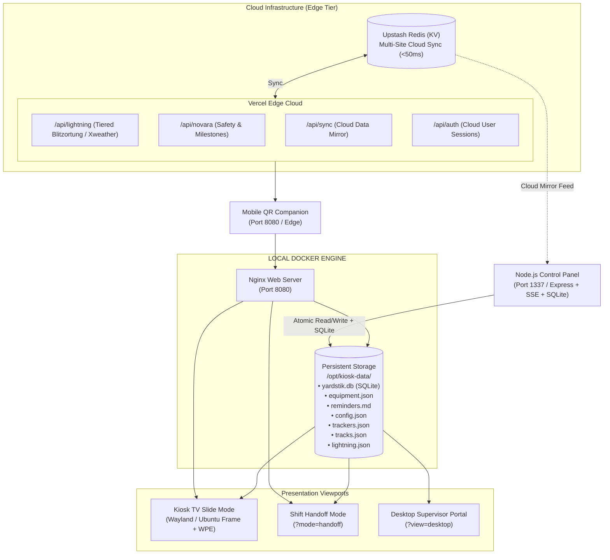

# 🚀 YardStik — Industrial Operations Dashboard & Break Room Kiosk System

[](https://github.com/TechSmith404/yardstik/releases)
[-brightgreen.svg)](https://github.com/TechSmith404/yardstik/actions)
[](https://www.docker.com/)
[](https://mir-server.io/ubuntu-frame)
[](https://nodejs.org/)
[](https://upstash.com/)
[](https://vercel.com/)
[]()

A robust, enterprise-grade industrial operations dashboard and unattended break room kiosk engineered specifically for heavy manufacturing, scrap metal recycling, steel processing, and rail terminal facilities.

Built from the ground up for **24/7 hardware-accelerated continuous operation**, YardStik bridges the communication gap between supervisory management, dispatch, and shop floor operators with air-gapped local reliability and optional multi-site cloud synchronization.

---

## 🌐 Live Interactive Demo

Experience YardStik's live viewports and administrative suite directly in your browser:

* 📺 **[Live Kiosk TV Display](https://kiosk-demo.techsmith404.com/?view=kiosk)** — Hardware-accelerated full-screen rotating break room presentation.
* ⚡ **[Shift Handoff Mode](https://kiosk-demo.techsmith404.com/?mode=handoff)** — High-density, multi-slide operations briefing view designed for shift changeovers.
* 🖥️ **[Desktop Supervisor Portal](https://kiosk-demo.techsmith404.com/desktop.html)** — Unified single-page scrollable dashboard with sticky section navigation for office workstations.
* 📱 **[Mobile Floor Companion](https://yardstik-test.vercel.app/mobile.html)** — Touch-optimized floor companion webapp hosted on Vercel Edge (*Auto-configured via `DEFAULT_SITE_ID: yardstik-demo`*).
* 🎛️ **[Administrative Control Panel](https://admin-demo.techsmith404.com)** — Dark-mode operations management suite (*Demo Login: `admin` / `demo` — resets automatically every 24 hours*).

---

## 📸 Screenshots & Visual Showcase

### 📺 View 1: Live Operations & Production Tracking (TV Kiosk Slide)

> *Auto-rotating TV view showcasing multi-category equipment status, mobile crane scale audits, active blend recipes, daylight/moon progression, shift handoff countdowns, and dynamic emergency weather slots.*

<p align="center">
  
</p>

---

### 📢 View 2: Daily Toolbox Talks & Safety Records (TV Kiosk / Handoff Mode)

> *Auto-rotating TV view featuring high-visibility Daily Toolbox Talks, dynamic Markdown reminder cards, upcoming employee milestones/anniversaries, and OSHA safety video completion trackers.*

<p align="center">
  
</p>

---

### 🚂 View 3: Interactive Yard Track Map & Reminders (TV Kiosk / Handoff Mode)

> *High-visibility vector SVG yard track map with live car counts, capacity gauges, color-coded commodity dashes, and high-priority operations reminder cards.*

<p align="center">
  
</p>

---

### 🖥️ Desktop Unified Supervisor Dashboard (`?view=desktop`)

> *Single-page scrollable operations center for office PCs and plant supervisors. Displays all operational widgets, track layouts, equipment rosters, and employee records simultaneously with a glassmorphism sticky navigation bar.*

<p align="center">
  
</p>

---

### 📱 Mobile Floor Portal (`mobile.html`)

> *Lightweight, mobile-responsive web portal accessible by scanning the break room TV's on-screen QR code. Enables shop floor personnel to inspect equipment status, track map occupancy, blend recipes, and training notices on the go with offline-first service worker caching.*

<p align="center">
  
</p>

---

### 🎛️ Bespoke Node.js Control Panel (`:1337`)

> *Centralized dark-mode administrative suite featuring user accounts & RBAC, operational audit logging, real-time equipment status toggling, track check upload & live editing, commodity classification rules, EasyMDE Markdown reminder editing, script runner terminal with live SSE streaming, and visual theme styling.*

<p align="center">
  
</p>

---

## 🌟 Key Capabilities & Architectural Highlights

### 1. 🖥️ Multi-Display & Shift Handoff Presentation Architecture

* **Kiosk TV Mode (`localhost:8080/?view=kiosk`):** Designed for unattended plant TVs. Automatically cycles active operational slides every 40 seconds with smooth hardware-accelerated transitions and zero screen burn-in risk.
* **Shift Handoff Mode (`localhost:8080/?mode=handoff`):** Purpose-built for shift turnover briefings and supervisor handoffs. Automatically activates during the first 15 minutes of a shift or manually via URL parameter. Rotates high-density briefing slides (Operations Overview, Daily Toolbox Talks & Safety, Yard Track Map & Multi-Reminders).
* **Desktop Unified Mode (`localhost:8080/?view=desktop`):** Auto-detected on LAN office computers. Eliminates slide rotation, rendering all plant data in a unified dual-column scrollable dashboard with sticky section anchors.
* **Mobile QR Portal (`localhost:8080/mobile.html`):** Instantly accessible by scanning the dynamic on-screen TV QR code. Includes offline-first service worker resilience for dead zones, touch-friendly bottom navigation, and live track inspections.

#### Presentation Slide Layout Matrix

| Presentation Mode | Track Map Flag | Slide 1 (`#view-production`) | Slide 2 (`#view-safety`) | Slide 3 (`#view-announcements`) |
| :--- | :--- | :--- | :--- | :--- |
| **Normal Kiosk TV** | `track_map: false` | Equipment Status + Right Sidebar Stats (OSHA, Blend, Daylight/Moon, Shift Tracker) | Daily Toolbox Talk (L) + Reminders (TR) + Milestones/Videos (BR) | *(Disabled / Skipped)* |
| **Normal Kiosk TV** | `track_map: true` | Equipment Status + Right Sidebar Stats | *(Disabled / Skipped)* | Yard Track Map (L) + Reminders (TR) + Milestones/Videos (BR) |
| **Shift Handoff Mode** | `track_map: false` | Equipment Status (Full Width) + Header Pills (Safe Days, Weather, Blend) | Daily Toolbox Talk (L) + Reminders (TR) + Milestones/Videos (BR) | *(Disabled / Skipped)* |
| **Shift Handoff Mode** | `track_map: true` | Equipment Status (Full Width) + Header Pills (Safe Days, Weather, Blend) | Daily Toolbox Talk (L) + Milestones/Videos (**Full Height Right**, Reminders hidden) | Yard Track Map (L) + Multi-Reminder Cards (R, **No Rotating Panels**) |
| **Desktop Portal** | Any | Unified single-page dual-column view with sticky navbar, live stats, and "What's New" modal | | |

---

### 2. 🚂 Interactive Yard Track Map & Spreadsheet Ingestion

* **Real-Time Vector SVG Canvas:** Dynamic SVG yard map visualization with pan/zoom support, animated capacity progress bars, diff-before-rebuild hash guards, and color-coded railcar indicators.
* **Multi-Column Excel & CSV Parser:** Robust Python ingestion engine (`parse_track_check.py`) capable of parsing complex multi-track side-by-side spreadsheets, extracting modified timestamps in UTC, and converting them to browser local time.
* **Dynamic Table Discovery & Out-of-Service Detection:** Automatically detects track headers across multiple columns, parses switch turnout out-of-service status (e.g. `Trk 1 / Trk 2 OS at Switch`), and breaks down parenthetical car count totals (e.g. `12 (4)`).
* **Dwell Time Warning System:** Computes railcar dwell times on site in days/hours, surfacing yellow warning badges when cars exceed configured dwell limits.
* **Commodity Rules & Visual Classification:** Customizable keyword matching and color assignments (Hot Rail, DLs, Blend, Scrap, Outbound Empty, Bad Order) managed directly from the Control Panel.
* **Server-Side SVG Sanitization:** All track map SVG uploads are validated and deeply sanitized using `DOMPurify` + `JSDOM` on the server, neutralizing `<script>`, `<foreignObject>`, inline handlers, and external resource beacons before writing to disk.

---

### 3. ⚖️ Equipment Status & Fail-Safe Sunday 11:00 PM Audit Protocol

* **Categorized Equipment Roster:** Engines, Cat Trucks, Overhead Cranes, Mobile Cranes, and Mobile Equipment with instant status badges (**`OK`**, **`OS` / Out of Service**, **`PM` / Maintenance Scheduled**) and custom issue notes styled via centralized CSS utility classes.
* **Mobile Crane Scale & Blend Audit Tracking:** Live scale health tracking (**`SCALE OK`** / **`SCALE OS`**) paired with weekly audit checkboxes (**`Audit: ✅/❌`**).
* **Automated Sunday 11:00 PM Reset Engine:** A failproof, three-tier automated audit reset system combining server-side background daemons, cloud self-healing, and client timestamp verification to guarantee weekly scale audit resets at the Sunday 11:00 PM shift changeover without manual overhead.

---

### 4. ⚡ Real-Time Lightning Detection & Weather Architecture

YardStik implements a cost-free, high-accuracy multi-tier lightning engine designed for OSHA severe weather compliance:

* **Free Blitzortung Community TOA Network (Primary / Default):** The on-premise container connects via live WebSocket directly to crowdsourced Time-of-Arrival sensor networks (`wss://ws1.blitzortung.org`). Decompresses raw LZW packets, computes Haversine distance and compass bearing to the plant site, and persists strikes within 15 miles to `/data/lightning.json`. **Eliminates commercial 10x API billing multipliers entirely.**
* **Tiered Cloud Provider Architecture (`api/lightning.js`):**
  * **Commercial Tier (`PAID_XWEATHER_API`):** If an enterprise commercial key is configured, queries Xweather directly for commercial SLA radar accuracy. If free trial keys also exist, candidate rotation burns free keys first before consuming paid quota.
  * **Free Community Default:** When no paid key is set, serves free Blitzortung strikes pushed from the on-premise kiosk.
  * **Backup Fallback (`FREE_XWEATHER_API`):** Multi-key rotation pool of free trial keys that automatically acts as a secondary fallback if Blitzortung has no strikes or the kiosk is offline. Failed keys are blacklisted in Redis for 10 days.
  * **Zero-Config All-Clear:** If no Xweather keys are configured, the system operates 100% on free Blitzortung and cleanly returns HTTP 200 All-Clear with zero 500 errors.
* **NWS Emergency Slot Allocation:** National Weather Service severe weather warnings (Tornado, Severe Thunderstorm, Flash Flood, Winter Storm, High Wind) dynamically commandeer base widget slots with pulsing emergency indicators.
* **Daylight & Moon Astronomy Tracker:** Accurately visualizes real-time sun arc elevation during the day, smoothly converting into a nocturnal blue moon with a sunrise countdown after dusk.
* **Hardware-Accelerated Canvas FX:** Realistic particle simulations for rain, heavy snowfall, drifting fog banks, and lightning flashes that dynamically activate based on live weather conditions.

---

### 5. 👥 User Accounts, RBAC & Operations Audit Trail

* **Embedded SQLite Database (`yardstik.db`):** Zero-maintenance local SQLite database running with WAL mode, foreign keys, and automated `PRAGMA user_version` migrations.
* **Role-Based Access Control (RBAC):**
  * **`admin`:** Full administrative access to Control Panel tabs, site configuration, automation scripts, employee invite creation, user role management, equipment edits, and audit log inspection/export.
  * **`maintenance`:** Shop floor quick-actions and equipment editing (`OK`/`OS`/`PM`, issue notes, crane scale audit toggles). Prohibited from executing server runners or altering site configuration.
  * **`viewer`:** Read-only access across Kiosk TVs, desktop supervisor portal, and mobile companion. Public dashboards **never** require a login.
* **Automated Admin Seeding:** On first boot, the database automatically seeds the `admin` account using whatever credentials already exist in `/opt/kiosk-data/config.json`.
* **Operations Audit Logging:** All state mutations, track uploads, equipment toggles, runner executions, and auth events are structured and recorded to the SQLite `audit_logs` ring-buffer with RFC-4180 CSV export via `GET /api/audit-logs/export`.

---

### 6. 🎂 Employee Recognition & LMS Compliance Tracking

* **Automated Seniority & Milestone Engine:** Calculates upcoming work anniversaries with support for historical legacy hire dates and relative countdown badges (`Today!`, `Tomorrow`, `in X days`).
* **Zero-Dependency SVG Avatars:** Generates initials-based SVG avatars directly on the server, eliminating third-party external avatar APIs (`ui-avatars.com`) and keeping employee PII completely private.
* **Action Required: Safety Videos:** Scans Novara/LMS training rosters to identify overdue or expiring monthly safety training modules, highlighting missing certifications by employee name.
* **11:00 PM Shift Rollover Offset:** Calculates daily toolbox talk slides with a +1 hour offset to ensure third-shift operators starting at 11:00 PM see current materials immediately.

---

### 7. 📝 Dynamic Markdown Reminders & Magic Words Engine

* **EasyMDE Web Editor:** Live in-browser Markdown authoring tool parsing `#` H1 slide delimiters, with DOMPurify sanitization to prevent XSS.
* **Markdown Magic Words:** Injects dynamic layouts and behaviors directly from simple markup tags:

| Magic Word | Function & Visual Behavior | Example |
| :--- | :--- | :--- |
| `!CRITICAL` | Displays a glowing crimson border and a pulsing `[CRITICAL]` badge. | `!CRITICAL` |
| `!HIGH` / `!IMPORTANT` | Displays a high-contrast amber border and an `[IMPORTANT]` header badge. | `!HIGH` |
| `!SPLIT` | Automatically splits bulleted (`-`) or numbered (`1.`) lists into 2 balanced columns. | `!SPLIT` |
| `!LARGE` | Enlarges body typography to 1.5rem for maximum legibility across large break rooms. | `!LARGE` |
| `!CENTER` | Centers text horizontally and vertically within the card container. | `!CENTER` |
| `!LONG` | Triples slide display duration from standard 40s to 120s (2 minutes). | `!LONG` |
| `!ONLY` | Emergency broadcast override: suppresses other reminder slides to display only this notice. | `!ONLY` |
| `!COUNTDOWN <target>` | Renders a live ticking countdown clock. Accepts `YYYY-MM-DD-HH(-mm)` or `MM-DD-HH-mm`. | `!COUNTDOWN 2026-10-31-17` |
| `!EXPIRE YYYY-MM-DD-HH` | Automatically purges and unpublishes the slide after the specified hour passes. | `!EXPIRE 2026-09-01-08` |
| `!QR <url>` | Generates an embedded high-contrast QR code for instant employee scanning. | `!QR https://plant-portal.com` |

---

### 8. 🛡️ Security Hardening & Silent Kiosk Lockdown

* **UFW Network Lockdown (`scripts/kiosk-lockdown.sh`):** Strict default `deny incoming`/`deny outgoing` policy; SSH (22) and Control Panel (1337) restricted strictly to authorized LAN subnets.
* **Kernel Hardening (`/etc/sysctl.d/99-kiosk-lockdown.conf`):** SYN flood defense, stealth ICMP echo disablement, and source routing blocks.
* **Physical USB Storage Disablement:** Blocks USB mass storage drivers (`install usb-storage /bin/true`) while preserving USB HID keyboards and mice.
* **Silent Boot Splash (`scripts/setup-boot-splash.sh`):** Replaces verbose kernel boot logging with a branded Plymouth splash screen and hardened GRUB configuration.
* **Offline-First Service Worker (`html/sw.js`):** Client-side service worker caches operational data (`tracks.json`, `equipment.json`, `reminders.md`) with a Network-First fallback policy, preventing blank screens in cellular dead zones.

---

## 🏗️ System Architecture



---

## 🧪 Automated Testing Architecture & Quality Assurance

YardStik implements a comprehensive, multi-tiered automated testing framework spanning Python, Node.js/JavaScript, and Bash environments:

```
======================================================================
  🧪 YardStik Automated Test Suite Runner (npm test)
======================================================================
  [1/3] Python Unit & Integration Suite (pytest) ....... 14 passed
  [2/3] JavaScript API & AST Compliance Suite (Jest) ... 162 passed (12 suites)
  [3/3] Shell Script Runner & Wayland Suite (Bats) ..... 21 passed (2 suites)
======================================================================
  🎉 ALL 197 TESTS PASSED! Quality assurance standards satisfied.
======================================================================
```

### Running the Tests

```bash
# Run the entire test suite across all three tiers
npm test
# or directly:
./scripts/run-all-tests.sh

# Run individual test tiers
npm run test:python   # Pytest spreadsheet engine suite
npm run test:js       # Jest, Supertest & AST compliance suite
npm run test:shell    # Bats shell runner & display suite
```

---

## 🚀 Installation & Deployment Guide

### 🏭 Fresh Kiosk Installation (`site-install.sh`)

To deploy YardStik on a fresh Ubuntu Server machine (Ubuntu 22.04 or 24.04 LTS recommended) connected to an industrial TV:

1. **Clone the Repository & Run Installer:**

   ```bash
   git clone https://github.com/TechSmith404/yardstik.git ~/kiosk-app
   cd ~/kiosk-app
   chmod +x site-install.sh
   ./site-install.sh
   ```

2. **What `site-install.sh` Does Automatically:**
   * **System Packages:** Installs Docker Engine, Docker Compose, Python 3, Snapd, and Avahi mDNS (`.local` discovery).
   * **Snap Compositor:** Installs and wires **Ubuntu Frame** (Wayland display server) and **WPE WebKit / Chromium**.
   * **Data Storage:** Initializes `/opt/kiosk-data/data/` and seeds default templates (`config.json`, `trackers.json`, `equipment.json`, etc.).
   * **Container Stack:** Builds and launches containerized services (`docker compose up -d --build`).
   * **Silent Boot Splash:** Installs Plymouth dark theme and silences kernel console logging.
   * **Security Lockdown:** Executes `scripts/kiosk-lockdown.sh` to configure UFW firewall and kernel network hardening.
   * **Auto-Update Cron:** Installs `kiosk-sync.sh` in crontab to automatically check for and apply updates every 15 minutes.

3. **Configure Site Identity:**
   Edit `/opt/kiosk-data/config.json` with your plant's coordinates and credentials:

   ```json
   {
     "site_name": "My Company — Plant Location",
     "site_id": "my-plant-id",
     "latitude": 41.6045,
     "longitude": -87.1311,
     "timezone": "America/Chicago",
     "vercel_api_url": "https://your-project.vercel.app",
     "admin_username": "admin",
     "admin_password": "CHANGE_ME_BEFORE_DEPLOYMENT"
   }
   ```

---

### 🔄 Automated Updates & Ongoing Sync (`kiosk-sync.sh`)

Production kiosks run [`kiosk-sync.sh`](file:///home/codaine/Documents/yardstik/kiosk-sync.sh) automatically via cron every 15 minutes:

* **Non-Destructive Git Sync:** Fetches from `origin/main` and updates the codebase without touching ephemeral site data in `/opt/kiosk-data/`.
* **Self-Healing Build Tracking:** Tracks `.last_built_commit` in persistent data. If changes to `server.js`, `Dockerfile`, or `package.json` are detected, it automatically executes `docker compose up -d --build --remove-orphans`.
* **Live TV Reload:** Automatically updates `version.txt`, which triggers an instant, zero-flicker reload on all connected TV displays.

#### Manual Update via SSH:
If you need to force an immediate update manually on the kiosk PC:

```bash
cd ~/kiosk-app
git pull origin main
docker compose up -d --build --remove-orphans
```

---

### 💻 Local Development Setup

```bash
# 1. Clone repository
git clone https://github.com/TechSmith404/yardstik.git
cd yardstik

# 2. Start development stack
docker compose up -d --build

# 3. Access presentation viewports
# Kiosk TV View:      http://localhost:8080/?view=kiosk
# Shift Handoff View: http://localhost:8080/?mode=handoff
# Desktop Portal:     http://localhost:8080/?view=desktop
# Mobile Companion:   http://localhost:8080/mobile.html
# Control Panel:      http://localhost:1337 (Login: admin / admin)
```

---

## 📁 Repository Structure

```
yardstik/
├── 📁 api/                        # Vercel serverless edge functions
│   ├── ⚡ auth.js                 # Cloud session authentication & RBAC
│   ├── ⚡ equipment.js            # Equipment status & scale audit endpoint
│   ├── ⚡ lightning.js            # Tiered Blitzortung TOA & Xweather radar proxy
│   ├── ⚡ novara.js               # Safety LMS & employee milestone scraper
│   ├── ⚡ sync.js                 # Multi-site cloud mirror endpoint
│   └── 📁 lib/                    # Shared cloud Redis, auth, and audit modules
│
├── 📁 control-panel/              # Administrative backend suite
│   ├── 📁 lib/                    # SQLite db, auth, audit, blitzortung & cloud modules
│   ├── 📁 middleware/             # Express RBAC & session verification middleware
│   ├── 📁 routes/                 # Modular domain routes (auth, users, equipment, tracks, etc.)
│   ├── 📁 runners/                # Executable automation task definitions (.json)
│   ├── 📁 public/                 # Dark-mode admin panel UI, login & register pages
│   ├── 📁 scripts/                # Automation runners & parse_track_check.py
│   └── 📄 server.js               # Express application entrypoint
│
├── 📁 html/                       # Kiosk presentation tier
│   ├── 📁 assets/data/            # Default state schemas & offline fixtures
│   ├── 📁 css/                    # Modular layout stylesheets (styles-v2.css)
│   ├── 📁 js/
│   │   ├── 📁 modules/            # Layout, Weather, Trackers, Milestones, Alerts, HTTP
│   │   ├── 📄 app.js              # State lifecycle & viewport controller
│   │   ├── 📄 desktop.js          # Desktop supervisor interaction engine
│   │   └── 📄 mobile.js           # Mobile companion interaction engine
│   ├── 🌐 index.html              # Kiosk TV (Ubuntu Frame) entrypoint
│   ├── 🖥️ desktop.html            # Dedicated supervisor desktop portal
│   ├── 📱 mobile.html             # QR-scanned mobile dashboard view
│   └── ⚙️ sw.js                   # Offline-first dead-zone service worker
│
├── 📁 scripts/                    # Provisioning, lockdown, splash & display verification
│   ├── 🔒 kiosk-lockdown.sh       # UFW firewall & kernel network hardening
│   ├── 🎨 setup-boot-splash.sh    # Silent Plymouth boot & GRUB configuration
│   ├── 🔍 verify-kiosk-display.sh # Automated Wayland & Chromium service auditor
│   └── 🧪 run-all-tests.sh        # Unified multi-tier test suite runner
│
├── 📁 tests/                      # Automated multi-tier testing framework
│   ├── 📁 js/                     # Jest endpoint, E2E simulation & AST compliance suite
│   ├── 📁 python/                 # Pytest track parser test suite
│   └── 📁 shell/                  # Bats shell script runner & display test suite
│
├── 🔄 kiosk-sync.sh               # Automated 15-minute GitHub auto-updater & builder
├── 🚀 site-install.sh             # Canonical fresh-machine setup script
├── 🐳 docker-compose.yml          # Container orchestration (Web + Control Panel)
├── 🐳 Dockerfile                  # Lightweight Nginx runtime image with dcron
├── ⚙️ nginx.conf                  # Static file server, reverse proxy & cache-control rules
├── 🏛️ SSoT.md                     # Single Source of Truth architecture specification
└── 📖 README.md                   # Project overview & documentation
```

---

## 🔒 Security & Data Integrity

* **Zero Regex Lookbehind & Zero Top-Level Await Guarantee:** Static AST compliance tests guarantee total crash immunity on embedded WebKit/Chromium kiosk browsers.
* **Strict Network Isolation:** UFW LAN firewall boundaries, kernel SYN flood defense, and ICMP echo silencing prevent unauthorized external access.
* **Dual Storage Engine:** Combines embedded SQLite (`yardstik.db`) for secure RBAC accounts and operations audit trails with persistent atomic JSON/Markdown flat-files for ultra-fast, air-gapped, corruption-immune frontend displays.
* **Tamper-Resistant Demo & Control Modes:** Server-side 403 authorization guardrails reject DevTools parameter manipulations for critical credentials and endpoints.

---

## 📄 Licensing & Commercial Usage

**Copyright © 2026 Cody Smith (TechSmith404). All Rights Reserved.**

This software, source code, architecture, and associated assets are the proprietary intellectual property of **Cody Smith**.

* **Authorized Pilot Evaluation:** Authorized solely for single-facility operational deployment and internal evaluation at the designated pilot facility.
* **Commercial Deployment & Enterprise Licensing:** Multi-plant installations, redistribution, white-labeling, or enterprise rollouts require an executed software licensing agreement or commercial services contract.

For commercial licensing, enterprise multi-plant deployments, or custom software development, contact: **cody.smith@techsmith404.com**.
