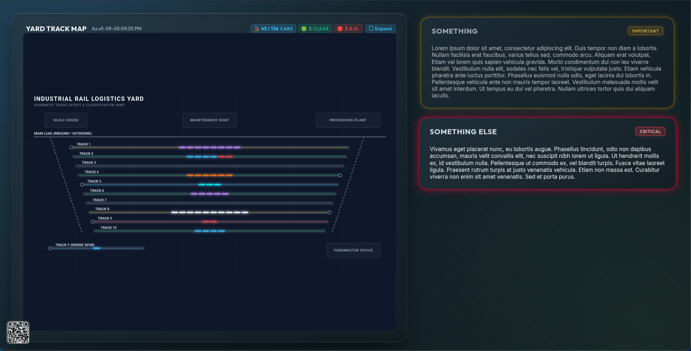
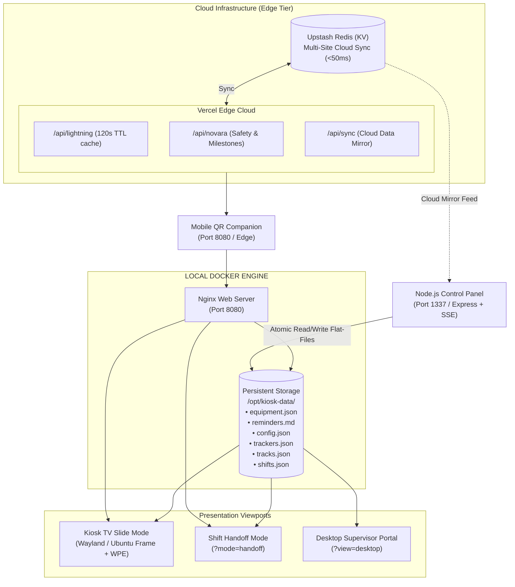

# 🚀 YardStik — Industrial Operations Dashboard & Break Room Kiosk System

[](https://github.com/TechSmith404/yardstik/releases)
[-brightgreen.svg)](https://github.com/TechSmith404/yardstik/actions)
[](https://www.docker.com/)
[](https://mir-server.io/ubuntu-frame)
[](https://nodejs.org/)
[](https://upstash.com/)
[](https://vercel.com/)
[]()

A robust, enterprise-grade industrial operations dashboard and unattended break room kiosk engineered specifically for heavy manufacturing, scrap metal recycling, steel processing, and rail terminal facilities.

Built from the ground up for **24/7 hardware-accelerated continuous operation**, YardStik bridges the communication gap between supervisory management, dispatch, and shop floor operators with air-gapped local reliability and optional multi-site cloud synchronization.

---

## 🌐 Live Interactive Demo

Experience YardStik's live viewports and administrative suite directly in your browser:

* 📺 **[Live Kiosk TV Display](https://yardstik-test.vercel.app/?view=kiosk&site=demo-site)** — Hardware-accelerated full-screen rotating break room presentation.
* ⚡ **[Shift Handoff Mode](https://yardstik-test.vercel.app/?mode=handoff&site=demo-site)** — High-density, multi-slide operations briefing view designed for shift changeovers.
* 🖥️ **[Desktop Supervisor Portal](https://yardstik-test.vercel.app/desktop.html?site=demo-site)** — Unified single-page scrollable dashboard with sticky section navigation for office workstations.
* 📱 **[Mobile Floor Companion](https://yardstik-test.vercel.app/mobile.html?site=demo-site)** — Touch-optimized floor companion webapp accessible via on-screen TV QR code.
* 🎛️ **[Administrative Control Panel](https://admin-demo.yourdomain.com)** — Dark-mode operations management suite (*Demo Login: `admin` / `demo` — resets automatically every 24 hours*).

---

## 📸 Screenshots & Visual Showcase

### 📺 View 1: Live Operations & Production Tracking (TV Kiosk Slide)

> *Auto-rotating TV view showcasing multi-category equipment status, mobile crane scale audits, active blend recipes, daylight/moon progression, shift handoff countdowns, and dynamic emergency weather slots.*

<p align="center">
  
</p>

---

### 📢 View 2: Daily Toolbox Talks & Safety Records (TV Kiosk / Handoff Mode)

> *Auto-rotating TV view featuring high-visibility Daily Toolbox Talks, dynamic Markdown reminder cards, upcoming employee milestones/anniversaries, and OSHA safety video completion trackers.*

<p align="center">
  
</p>

---

### 🚂 View 3: Interactive Yard Track Map & Reminders (TV Kiosk / Handoff Mode)

> *High-visibility vector SVG yard track map with live car counts, capacity gauges, color-coded commodity dashes, and high-priority operations reminder cards.*

<p align="center">
  
</p>

---

### 🖥️ Desktop Unified Supervisor Dashboard (`?view=desktop`)

> *Single-page scrollable operations center for office PCs and plant supervisors. Displays all operational widgets, track layouts, equipment rosters, and employee records simultaneously with a glassmorphism sticky navigation bar.*

<p align="center">
  
</p>

---

### 📱 Mobile Floor Portal (`mobile.html`)

> *Lightweight, mobile-responsive web portal accessible by scanning the break room TV's on-screen QR code. Enables shop floor personnel to inspect equipment status, track map occupancy, blend recipes, and training notices on the go.*

<p align="center">
  
</p>

---

### 🎛️ Bespoke Node.js Control Panel (`:1337`)

> *Centralized dark-mode administrative suite featuring real-time equipment status toggling, track check upload & live editing, commodity classification rules, EasyMDE Markdown reminder editing, script runner terminal with live SSE streaming, and visual theme styling.*

<p align="center">
  
</p>

---

## 🌟 Key Capabilities & Architectural Highlights

### 1. 🖥️ Multi-Display & Shift Handoff Presentation Architecture

* **Kiosk TV Mode (`localhost:8080/?view=kiosk`):** Designed for unattended plant TVs. Automatically cycles active operational slides every 40 seconds with smooth hardware-accelerated transitions and zero screen burn-in risk.
* **Shift Handoff Mode (`localhost:8080/?mode=handoff`):** Purpose-built for shift turnover briefings and supervisor handoffs. Automatically activates during the first 15 minutes of a shift or manually via URL parameter. Rotates high-density briefing slides (Operations Overview, Daily Toolbox Talks & Safety, Yard Track Map & Multi-Reminders).
* **Desktop Unified Mode (`localhost:8080/?view=desktop`):** Auto-detected on LAN office computers. Eliminates slide rotation, rendering all plant data in a unified dual-column scrollable dashboard with sticky section anchors.
* **Mobile QR Portal (`localhost:8080/mobile.html`):** Instantly accessible by scanning the dynamic on-screen TV QR code. Includes multi-tier offline caching, touch-friendly controls, and live track check inspections.

#### Presentation Slide Layout Matrix

| Presentation Mode | Track Map Flag | Slide 1 (`#view-production`) | Slide 2 (`#view-safety`) | Slide 3 (`#view-announcements`) |
| :--- | :--- | :--- | :--- | :--- |
| **Normal Kiosk TV** | `track_map: false` | Equipment Status + Right Sidebar Stats (OSHA, Blend, Daylight/Moon, Shift Tracker) | Daily Toolbox Talk (L) + Reminders (TR) + Milestones/Videos (BR) | *(Disabled / Skipped)* |
| **Normal Kiosk TV** | `track_map: true` | Equipment Status + Right Sidebar Stats | *(Disabled / Skipped)* | Yard Track Map (L) + Reminders (TR) + Milestones/Videos (BR) |
| **Shift Handoff Mode** | `track_map: false` | Equipment Status (Full Width) + Header Pills (Safe Days, Weather, Blend) | Daily Toolbox Talk (L) + Reminders (TR) + Milestones/Videos (BR) | *(Disabled / Skipped)* |
| **Shift Handoff Mode** | `track_map: true` | Equipment Status (Full Width) + Header Pills (Safe Days, Weather, Blend) | Daily Toolbox Talk (L) + Milestones/Videos (**Full Height Right**, Reminders hidden) | Yard Track Map (L) + Multi-Reminder Cards (R, **No Rotating Panels**) |
| **Desktop Portal** | Any | Unified single-page dual-column view with sticky navbar, live stats, and "What's New" modal | | |

---

### 2. 🚂 Interactive Yard Track Map & Spreadsheet Ingestion

* **Real-Time Vector SVG Canvas:** Dynamic SVG yard map visualization with pan/zoom support, animated capacity progress bars, and color-coded railcar indicators.
* **Multi-Column Excel & CSV Parser:** Robust Python ingestion engine (`parse_track_check.py`) capable of parsing complex multi-track side-by-side spreadsheets, extracting modified timestamps in UTC, and converting them to browser local time.
* **Dynamic Table Discovery & Out-of-Service Detection:** Automatically detects track headers across multiple columns, parses switch turnout out-of-service status (e.g. `Trk 1 / Trk 2 OS at Switch`), and breaks down parenthetical car count totals (e.g. `12 (4)`).
* **Dwell Time Warning System:** Computes railcar dwell times on site in days/hours, surfacing yellow warning badges when cars exceed configured dwell limits.
* **Commodity Rules & Visual Classification:** Customizable keyword matching and color assignments (Hot Rail, DLs, Blend, Scrap, Outbound Empty, Bad Order) managed directly from the Control Panel.

---

### 3. ⚖️ Equipment Status & Fail-Safe Sunday 11:00 PM Audit Protocol

* **Categorized Equipment Roster:** Engines, Cat Trucks, Overhead Cranes, Mobile Cranes, and Mobile Equipment with instant status badges (**`OK`**, **`OS` / Out of Service**, **`PM` / Maintenance Scheduled**) and custom issue notes.
* **Mobile Crane Scale & Blend Audit Tracking:** Live scale health tracking (**`SCALE OK`** / **`SCALE OS`**) paired with weekly audit checkboxes (**`Audit: ✅/❌`**).
* **Automated Sunday 11:00 PM Reset Engine:** A failproof, three-tier automated audit reset system combining server-side background daemons, cloud self-healing, and client timestamp verification to guarantee weekly scale audit resets at the Sunday 11:00 PM shift changeover without manual overhead.

---

### 4. 🌦️ Dynamic Weather Engine & Emergency Protocol

* **NWS Emergency Slot Allocation:** National Weather Service severe weather warnings (Tornado, Severe Thunderstorm, Flash Flood, Winter Storm, High Wind) dynamically commandeer base widget slots with pulsing emergency indicators.
* **Xweather Real-Time Lightning Protocol:** Tracks lightning strikes within a 10-mile radius, automatically activating safety warnings and initiating a live second-by-second countdown to the 30-minute OSHA "All-Clear".
* **Upstash Redis Serverless Edge Cache:** High-performance caching layer (120s TTL) with automated key-exhaustion rotation across backup API credentials to guarantee zero quota outages.
* **Daylight & Moon Astronomy Tracker:** Accurately visualizes real-time sun arc elevation during the day, smoothly converting into a nocturnal blue moon with a sunrise countdown after dusk.
* **Hardware-Accelerated Canvas FX:** Realistic particle simulations for rain, heavy snowfall, drifting fog banks, and lightning flashes that dynamically activate based on live weather conditions.

---

### 5. 🎂 Employee Recognition & LMS Compliance Tracking

* **Automated Seniority & Milestone Engine:** Calculates upcoming work anniversaries with support for historical legacy hire dates and relative countdown badges (`Today!`, `Tomorrow`, `in X days`).
* **Action Required: Safety Videos:** Scans Novara/LMS training rosters to identify overdue or expiring monthly safety training modules, highlighting missing certifications by employee name.
* **11:00 PM Shift Rollover Offset:** Calculates daily toolbox talk slides with a +1 hour offset to ensure third-shift operators starting at 11:00 PM see current materials immediately.

---

### 6. 📝 Dynamic Markdown Reminders & Magic Words Engine

* **EasyMDE Web Editor:** Live in-browser Markdown authoring tool parsing `#` H1 slide delimiters.
* **Markdown Magic Words:** Injects dynamic layouts and behaviors directly from simple markup tags:

| Magic Word | Function & Visual Behavior | Example |
| :--- | :--- | :--- |
| `!CRITICAL` | Displays a glowing crimson border and a pulsing `[CRITICAL]` badge. | `!CRITICAL` |
| `!HIGH` / `!IMPORTANT` | Displays a high-contrast amber border and an `[IMPORTANT]` header badge. | `!HIGH` |
| `!SPLIT` | Automatically splits bulleted (`-`) or numbered (`1.`) lists into 2 balanced columns. | `!SPLIT` |
| `!LARGE` | Enlarges body typography to 1.5rem for maximum legibility across large break rooms. | `!LARGE` |
| `!CENTER` | Centers text horizontally and vertically within the card container. | `!CENTER` |
| `!LONG` | Triples slide display duration from standard 40s to 120s (2 minutes). | `!LONG` |
| `!ONLY` | Emergency broadcast override: suppresses other reminder slides to display only this notice. | `!ONLY` |
| `!COUNTDOWN <target>` | Renders a live ticking countdown clock. Accepts `YYYY-MM-DD-HH(-mm)` or `MM-DD-HH-mm`. | `!COUNTDOWN 2026-10-31-17` |
| `!EXPIRE YYYY-MM-DD-HH` | Automatically purges and unpublishes the slide after the specified hour passes. | `!EXPIRE 2026-09-01-08` |
| `!QR <url>` | Generates an embedded high-contrast QR code for instant employee scanning. | `!QR https://plant-portal.com` |

---

### 7. 📱 High-Contrast TV QR Code Scanning Protocol

* **Optimized Distance Scanning:** Docked unobtrusively in the bottom-right margin inside a sleek frosted glass card (`rgba(15, 23, 42, 0.9)`).
* **Pure Quiet Zone:** Backed by an inner solid white plate (`#ffffff` with 4px padding) with medium error correction (`&ecc=M`), 150x150 resolution, and pixelated rendering (`image-rendering: pixelated; crisp-edges;`) for flawless 4–10 foot smartphone camera recognition.

---

### 8. 🛡️ Security Hardening & Silent Kiosk Lockdown

* **UFW Network Lockdown (`scripts/kiosk-lockdown.sh`):** Strict default `deny incoming`/`deny outgoing` policy; SSH (22) and Control Panel (1337) restricted strictly to authorized LAN subnets.
* **Kernel Hardening (`/etc/sysctl.d/99-kiosk-lockdown.conf`):** SYN flood defense, stealth ICMP echo disablement, and source routing blocks.
* **Physical USB Storage Disablement:** Blocks USB mass storage drivers (`install usb-storage /bin/true`) while preserving USB HID keyboards and mice.
* **Silent Boot Splash (`scripts/setup-boot-splash.sh`):** Replaces verbose kernel boot logging with a branded Plymouth splash screen and hardened GRUB configuration.

---

## 🏗️ System Architecture



---

## 🧪 Automated Testing Architecture & Quality Assurance

YardStik implements a comprehensive, multi-tiered automated testing framework spanning Python, Node.js/JavaScript, and Bash environments:

```
======================================================================
  🧪 YardStik Automated Test Suite Runner (npm test)
======================================================================
  [1/3] Python Unit & Integration Suite (pytest) ....... 14 passed
  [2/3] JavaScript API & AST Compliance Suite (Jest) ... 28 passed
  [3/3] Shell Script Runner Suite (Bats) ...............  7 passed
======================================================================
  🎉 ALL 49 TESTS PASSED! Quality assurance standards satisfied.
======================================================================
```

### Test Suite Matrix

| Test Tier | Framework | Test Files | Target Systems & Coverage |
| :--- | :--- | :--- | :--- |
| **Python Unit & Integration** | `pytest` (v9+) | `tests/python/test_parse_track_check.py`<br>`tests/python/conftest.py` | Multi-column spreadsheet engine (`parse_track_check.py`), dynamic table discovery, parenthetical car count breakdowns (`12 (4)`), out-of-service switch turnout regex detection (before/after O.S. markers), dwell time calculations (>= 5 days), bad order flags, and atomic JSON persistence. |
| **Node.js Express Endpoints** | `Jest` + `Supertest` | `tests/js/control_panel.test.js` | Administrative Control Panel (`server.js`), HTTP Basic Auth challenge & rejection, Sunday 11:00 PM Scale Audit Reset engine verification, SVG upload security sanitization (blocking `<script>`, `<foreignObject>`, inline event handlers, and `javascript:` URIs), equipment/reminders/features/rules CRUD, and runner registry. |
| **Architectural AST Compliance** | `Jest` + `Acorn` | `tests/js/ssot_ast_compliance.test.js` | Static AST scanning across all frontend JavaScript files in `html/js/**/*.js` enforcing strict SSoT §9.1 compatibility: statically guarantees **zero regex lookbehinds** (`(?<=...)`, `(?<!...)`) and **zero top-level `await`** across the entire kiosk client bundle. |
| **Serverless Cloud Functions** | `Jest` | `tests/js/cloud_api.test.js` | Vercel Serverless Edge Endpoints (`api/sync.js`, `api/lightning.js`), `SYNC_SECRET` enforcement, Redis pipeline batching, coordinate normalization, and Xweather fallback error handling. |
| **Handoff Mode Lifecycle** | `Jest` | `tests/js/handoff_lifecycle.test.js` | Handoff mode activation/deactivation DOM lifecycle, clean element restoration, and panel re-anchoring. |
| **Shell Runner Utilities** | `Bats` (v1.13+) | `tests/shell/test_runner_scripts.bats` | Containerized shell runners (`update_osha.sh`, `update_blend.sh`, `upload_override.sh`), date format regex validation (`YYYY-MM-DD`), non-image upload rejection, parameter sanitization, and exit code accuracy. |

### Running the Tests

```bash
# Run the entire test suite across all three tiers
npm test

# Run individual test tiers
npm run test:python   # Pytest suite
npm run test:js       # Jest & AST compliance suite
npm run test:shell    # Bats shell runner suite
```

---

## 🚀 Installation & Deployment Guide

### Prerequisites

* **Operating System:** Linux PC (Ubuntu 22.04 / 24.04 LTS recommended) connected to the TV display.
* **Container Runtime:** Docker Engine & Docker Compose (`docker compose` v2).
* **Display Server (for Unattended TV Kiosks):** Ubuntu Frame & WPE WebKit / Chromium:
  
  ```bash
  sudo snap install ubuntu-frame
  sudo snap install wpe-webkit-mir-kiosk
  ```

---

### 💻 Local Development Setup

1. **Clone the Repository:**
   
   ```bash
   git clone https://github.com/TechSmith404/yardstik.git
   cd yardstik
   git checkout dev
   ```

2. **Launch Docker Stack:**
   
   ```bash
   # Run the unified development startup script
   ./scripts/test-local.sh
   
   # Or launch directly with Docker Compose
   docker compose up -d --build
   ```

3. **Access Services:**
   
   * **TV Slide Kiosk Display:** [`http://localhost:8080/?view=kiosk`](http://localhost:8080/?view=kiosk)
   * **Shift Handoff Mode:** [`http://localhost:8080/?mode=handoff`](http://localhost:8080/?mode=handoff)
   * **Desktop Supervisor View:** [`http://localhost:8080/?view=desktop`](http://localhost:8080/?view=desktop)
   * **Mobile QR Portal:** [`http://localhost:8080/mobile.html`](http://localhost:8080/mobile.html)
   * **Administrative Control Panel:** [`http://localhost:1337`](http://localhost:1337) *(Default: `admin` / `MasterPassword123`)*

---

### 🏭 Production Kiosk Deployment

1. **Package Deployment Artifact (on Workstation):**
   
   ```bash
   ./scripts/package.sh
   ```
   
   *Creates a clean, production-ready `kiosk-deployment.zip` payload.*

2. **Transfer to Target Kiosk Machine:**
   
   ```bash
   scp kiosk-deployment.zip user@kiosk-ip:~/tmp/
   ```

3. **Execute Remote Automated Installation:**
   
   ```bash
   ssh user@kiosk-ip
   cd ~/kiosk-app
   sudo ./site-install.sh
   ```
   
   *The deployment suite automatically provisions Ubuntu Frame, configures silent Plymouth splash screens, applies strict UFW network firewall lockdown, unpacks updated assets, and spins up containerized services.*

---

## 📁 Repository Structure

```
yardstik/
├── 📁 api/                        # Vercel serverless edge functions
│   ├── ⚡ lightning.js             # 120s TTL radar & lightning proxy cache
│   ├── ⚡ novara.js                # Safety LMS & employee milestone scraper
│   └── ⚡ sync.js                  # Multi-site cloud mirror endpoint
│
├── 📁 control-panel/              # Administrative backend suite
│   ├── 📁 conf/runners/           # Executable task definitions (.json)
│   ├── 📁 public/                 # Dark-mode admin panel UI (Vanilla JS)
│   ├── 📁 scripts/                # Child process automation shell scripts
│   │   └── 🐍 parse_track_check.py# Multi-column railcar spreadsheet engine
│   └── 📄 server.js               # Express API, SSE runner & audit daemon
│
├── 📁 html/                       # Kiosk presentation tier
│   ├── 📁 assets/data/            # Default state schemas & offline fixtures
│   ├── 📁 css/                    # Modular layout stylesheets
│   ├── 📁 js/
│   │   ├── 📁 modules/            # Weather, Trackers, Milestones, Alerts
│   │   ├── 📄 app.js              # State lifecycle & viewport controller
│   │   └── 📄 desktop.js          # Desktop supervisor interaction engine
│   ├── 🌐 index.html              # Kiosk TV (Ubuntu Frame) entrypoint
│   ├── 🖥️ desktop.html            # Dedicated supervisor desktop portal
│   └── 📱 mobile.html             # QR-scanned mobile dashboard view
│
├── 📁 scripts/                    # Deployment, lockdown, splash & sync tooling
│   ├── 🔒 kiosk-lockdown.sh       # UFW firewall & kernel network hardening
│   ├── 🎨 setup-boot-splash.sh    # Silent Plymouth boot & GRUB configuration
│   ├── 🔄 kiosk-sync.sh           # Automated 15-minute GitHub auto-updater
│   └── 🧪 run-all-tests.sh        # Unified multi-tier test suite runner
│
├── 📁 tests/                      # Automated multi-tier testing framework
│   ├── 📁 js/                     # Jest endpoint & AST compliance suite
│   ├── 📁 python/                 # Pytest track parser test suite
│   └── 📁 shell/                  # Bats shell script runner test suite
│
├── 🐳 docker-compose.yml          # Container orchestration (Web + Control Panel)
├── 🐳 Dockerfile                  # Lightweight Nginx runtime image with cron
├── ⚙️ nginx.conf                  # Static file server & cache-control rules
├── 🏛️ SSoT.md                     # Single Source of Truth architecture specification
└── 📖 README.md                   # Project overview & documentation
```

---

## 🔒 Security & Data Integrity

* **Zero Regex Lookbehind & Zero Top-Level Await Guarantee:** Static AST compliance tests guarantee total crash immunity on embedded WebKit/Chromium kiosk browsers.
* **Strict Network Isolation:** UFW LAN firewall boundaries, kernel SYN flood defense, and ICMP echo silencing prevent unauthorized external access.
* **Tamper-Resistant Demo & Control Modes:** Server-side 403 authorization guardrails reject DevTools parameter manipulations for critical credentials and endpoints.
* **No Database Dependency:** Operates on lightweight, persistent atomic JSON and Markdown flat-files, ensuring lightning-fast boot times, instantaneous backups, and immunity from SQL corruption.

---

## 📄 Licensing & Commercial Usage

**Copyright © 2026 Cody Smith (TechSmith404). All Rights Reserved.**

This software, source code, architecture, and associated assets are the proprietary intellectual property of **Cody Smith**.

* **Authorized Pilot Evaluation:** Authorized solely for single-facility operational deployment and internal evaluation at the designated pilot facility.
* **Commercial Deployment & Enterprise Licensing:** Multi-plant installations, redistribution, white-labeling, or enterprise rollouts require an executed software licensing agreement or commercial services contract.

For commercial licensing, enterprise multi-plant deployments, or custom software development, contact: **cody.smith@techsmith404.com**.
