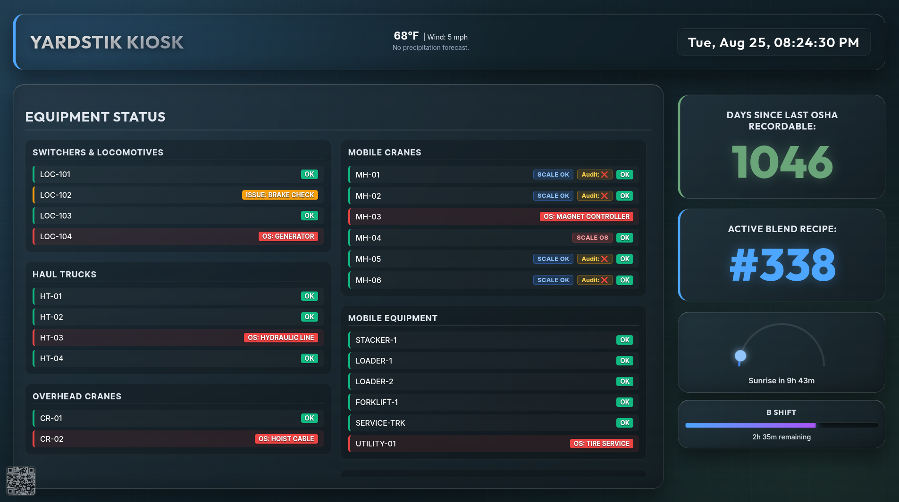
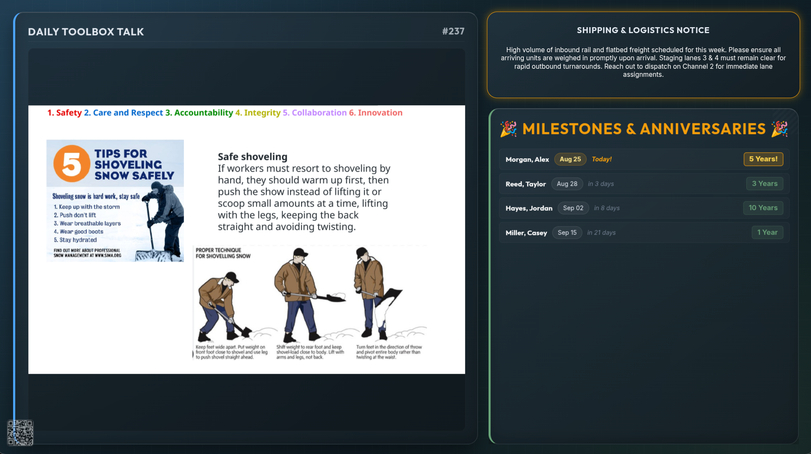
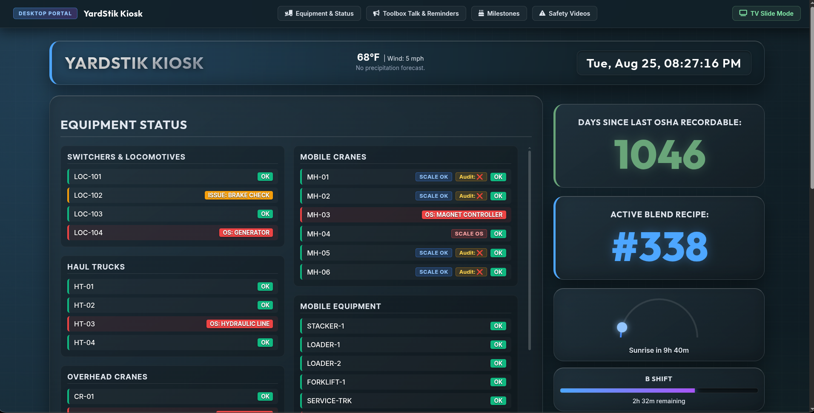
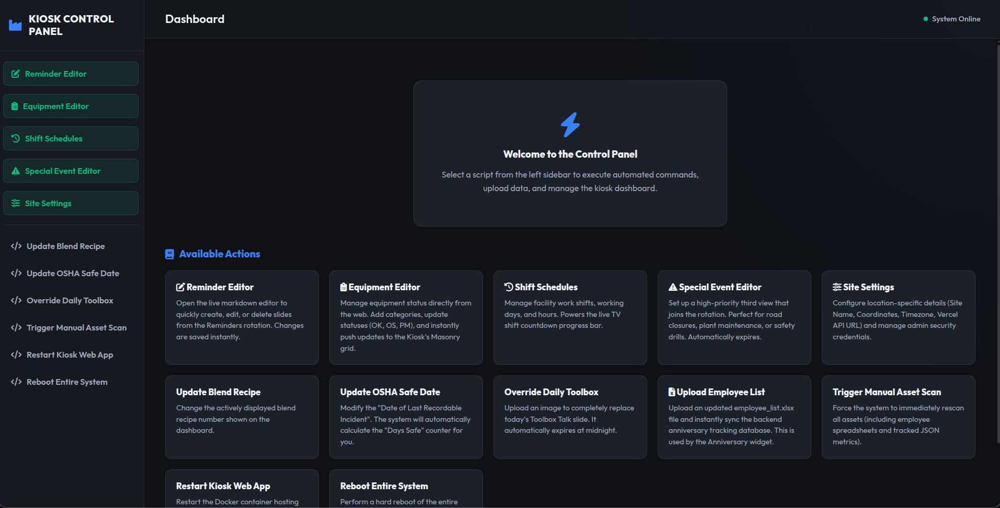
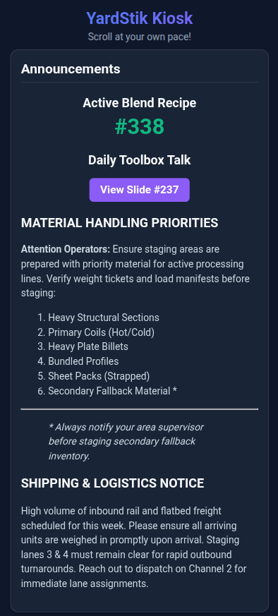

# 🚀 YardStik — Operations Dashboard & Break Room Kiosk System

[](https://github.com/TechSmith404/yardstik/releases/tag/v4.0.0)
[](https://www.docker.com/)
[](https://mir-server.io/ubuntu-frame)
[](https://nodejs.org/)
[](https://upstash.com/)
[](https://vercel.com/)

A modern, high-reliability industrial operations dashboard and break-room kiosk designed for manufacturing and metal-processing plant environments.

Features a **dual-engine presentation system**: passive auto-rotating slides for unattended plant TVs, a responsive single-page scrollable dashboard for desktop workstations, and an ultra-fast mobile portal for shop floor personnel.

---

## 📸 Screenshots & Visual Tour

### 📺 TV Slide Mode — Operations & Production View
> *Auto-rotating 40s TV slide displaying live equipment status, active blend recipes, sun/moon daylight cycle, shift progress, and dynamic emergency weather slots.*

<p align="center">
  
</p>

<br>

### 📢 TV Slide Mode — Announcements & Safety Records
> *Auto-rotating 40s TV slide displaying the Daily Toolbox Talk, dynamic Markdown reminders, upcoming employee milestones, and required safety training video alerts.*

<p align="center">
  
</p>

<br>

### 🖥️ Desktop Unified Scroll Mode (`?view=desktop`)
> *Single-page scrollable dashboard for office PCs with glassmorphism navigation, full-length employee cards, and manual scrollable equipment grids.*

<p align="center">
  
</p>

<br>

### 🎛️ Node.js Control Panel & Script Terminal
> *Web-based administration panel featuring an equipment status editor, EasyMDE Markdown notice editor, runner execution engine, and real-time streaming terminal.*

<p align="center">
  
</p>

<br>

### 📱 Mobile Floor Portal (`mobile.html`)
> *Lightweight, touch-friendly mobile interface accessible via break-room QR code for on-the-go equipment checks and weather alerts.*

<p align="center">
  
</p>

---

## ✨ Key Features

### 1. 🖥️ Triple-Display Adaptive Experience
* **Kiosk TV Mode (Default on `localhost`):** Auto-rotates between View 1 (Operations) and View 2 (Safety/Announcements) every 40 seconds. Seamless sub-panel flipping between Anniversaries and Safety Videos.
* **Desktop Unified Mode (`?view=desktop`):** Auto-detected on LAN desktop browsers. Displays all operational, announcement, and milestone widgets simultaneously in an independent 2-column flex layout with a sticky glassmorphism header navigation bar.
* **Mobile Portal (`mobile.html` or `?view=mobile`):** Auto-redirects smartphones and tablets scanning the on-screen QR code.

### 2. ⚖️ Equipment Status & Weekly Blend Audit Tracking
* Multi-category equipment dashboard (**Engines, Cat Trucks, Overhead Cranes, Mobile Cranes, Mobile Equipment, Other**).
* Visual status pills (**`OK`**, **`OS` / Out of Service**, **`PM` / Maintenance Issue**) with custom issue reason labels.
* **Mobile Cranes Scale & Blend Audit Tracking:**
  * Dynamic scale status indicator (**`SCALE OK`**, **`SCALE OS`**).
  * Interactive weekly blend audit checkbox (**`Audit: ✅`** / **`Audit: ❌`**).
  * **Failproof Sunday 11:00 PM Audit Reset:** Automated 60-second background daemon in Node.js, cloud sync auto-healing, and client-side epoch verification ensure audits reset to `❌` every Sunday at 11:00 PM without manual intervention.

### 3. 🌦️ Dynamic Weather Engine & Live Canvas FX
* **National Weather Service (NWS) Alerts:** Severe Thunderstorm, Tornado, Flash Flood, Wind, and Winter Storm warnings automatically hijack dedicated dashboard slots with hardware-accelerated emergency pulsing borders.
* **Xweather Lightning Strike Protocol:** Detects strikes within a 10-mile radius and renders an active second-by-second countdown to the 30-minute "All-Clear".
* **Upstash Redis Serverless Caching (120s TTL):** Strict quota protection with a 10-day key exhaustion blacklisting mechanism that manages staggered monthly multi-account quota resets.
* **Daylight & Moon Tracker:** Tracks real-time sun elevation across daytime hours, seamlessly transitioning at dusk into a nocturnal blue moon with a countdown to sunrise.
* **Canvas FX Overlays:** Hardware-accelerated dynamic particle simulations for rain, snow, lightning flashes, dense drifting fog, and emergency vignettes.

### 4. 🎂 Employee Milestones & Novara Safety Video Tracker
* **Automated Novara Milestone Engine:** Real-time anniversary calculations with built-in legacy hire date seniority overrides. Displays relative countdowns (`Today!`, `Tomorrow`, `in X days`) and celebratory amber glowing badges.
* **Action Required: Safety Videos:** Tracks overdue or expiring employee OSHA/safety training modules and renders sorted employee badges with avatar integration.

### 5. 📝 Dynamic Markdown Reminders Engine
* EasyMDE-powered Markdown notices parsed from `#` (H1) section headers.
* **Markdown Magic Words:** Injects dynamic styling, timers, layouts, and priority flags directly into slide content.

### 6. 🎛️ Bespoke Node.js Express Control Panel
* Replaces legacy script-servers with a modern dark-mode administrative suite.
* Direct interactive editors for Equipment, Markdown Reminders, Shift Schedules, and Site Config.
* Safe background script runner with real-time SSE terminal log streaming.
* Multi-site cloud push architecture syncing live files to Upstash Redis in <50ms.

---

## 🪄 Markdown Magic Words Reference

Place these custom magic flags anywhere below an `# H1` header in the **Reminder Editor** to dynamically alter slide behavior and visual formatting:

| Magic Word | Description | Example |
| :--- | :--- | :--- |
| `!CRITICAL` | Displays glowing crimson pulsing border and a `[CRITICAL]` header badge. | `!CRITICAL` |
| `!HIGH` | Displays glowing amber border and an `[IMPORTANT]` header badge. | `!HIGH` |
| `!SPLIT` | Automatically splits bulleted (`-`) or numbered (`1.`) lists into 2 balanced columns. | `!SPLIT` |
| `!LARGE` | Increases slide body font size to 1.5rem for high-visibility notices. | `!LARGE` |
| `!CENTER` | Centers the notice text both vertically and horizontally within the card. | `!CENTER` |
| `!LONG` | Extends the TV kiosk display duration from 40s to 120s (2 minutes). | `!LONG` |
| `!ONLY` | Priority override: hides all other reminder slides and displays only this slide. | `!ONLY` |
| `!COUNTDOWN MM-DD-HH-mm` | Renders a live ticking countdown timer to a specific target date/time. | `!COUNTDOWN 10-31-17-00` |
| `!EXPIRE YYYY-MM-DD-HH` | Automatically stops displaying and discards the slide after the specified hour. | `!EXPIRE 2026-09-01-08` |
| `!QR <url>` | Generates and embeds a high-contrast QR code for employees to scan on their phones. | `!QR https://your-kiosk.vercel.app` |

---

## 🏗️ Architecture & Technology Stack

```
                                  ┌────────────────────────────────────────┐
                                  │           Upstash Redis (KV)           │
                                  │   Multi-Site Cloud Sync (<50ms)        │
             │  Vercel Serverless  │                            │ Node.js / Express   │
             │   Edge API Layer    │                            │    Control Panel    │
             │   (/api/lightning)  │                            │     (Port 5000)     │
             │   (/api/novara)     │                            └──────────┬──────────┘
             │   (/api/sync)       │                                       │ (Writes JSON/MD)
             └──────────┬──────────┘                                       ▼
                        │                                       ┌─────────────────────┐
                        ▼                                       │   Local /data dir   │
             ┌─────────────────────┐                            │   - equipment.json  │
             │  Mobile QR Portal   │                            │   - reminders.md    │
             │   (mobile.html)     │                            │   - config.json     │
             └──────────┬──────────┘                            └──────────┬──────────┘
                                                                           │ (Serves Static)
                                                                           ▼
                                                                ┌─────────────────────┐
                                                                │     Nginx Web       │
                                                                │    (Port 8080)      │
                                                                └──────────┬──────────┘
                                                                           │
                                              ┌────────────────────────────┴────────────────────────────┐
                                              ▼                                                         ▼
                                   ┌─────────────────────┐                                   ┌─────────────────────┐
                                   │ Kiosk TV Slide Mode │                                   │ Desktop Scroll Mode │
                                   │  (Ubuntu Frame +    │                                   │  (?view=desktop)    │
                                   │  Chromium Kiosk)    │                                   └─────────────────────┘
                                   └─────────────────────┘
```

* **Frontend:** Vanilla JavaScript (ES6+), HTML5 Canvas FX, Marked.js, CSS3 Custom Properties (Variables) & Grid Layouts.
* **Control Panel Backend:** Node.js, Express, Multer, EasyMDE, Child Process Execution Engine.
* **Display Server (Kiosk PC):** Ubuntu Frame (Wayland), Chromium Kiosk Mode, Systemd User Services.
* **Web Server & Reverse Proxy:** Nginx Alpine (Docker).
* **Cloud & Serverless:** Vercel Edge Serverless Functions, Upstash Redis (REST / ioredis).
* **External APIs:** National Weather Service API, Open-Meteo, Xweather (AerisWeather).

---

## 🚀 Deployment & Installation Guide

### Prerequisites
* A Linux PC (Ubuntu 22.04 / 24.04 recommended) connected to the TV display.
* **Docker** & **Docker Compose** installed.
* **Ubuntu Frame** and **Chromium** installed via Snap (for unattended TV Kiosk mode):
  ```bash
  sudo snap install ubuntu-frame
  sudo snap install chromium
  ```

---

### 📦 Local Development Setup

1. **Clone the Repository:**
   ```bash
   git clone https://github.com/TechSmith404/yardstik.git
   cd yardstik
   git checkout main
   ```

2. **Install Control Panel Dependencies:**
   ```bash
   cd control-panel
   npm install
   cd ..
   ```

3. **Start the Development Server:**
   ```bash
   # Start the Control Panel server
   node control-panel/server.js
   
   # Or launch the full Docker environment
   docker-compose up -d --build
   ```

4. **Access the Application:**
   * **TV Kiosk Slide Mode:** [`http://localhost:8080/?view=kiosk`](http://localhost:8080/?view=kiosk)
   * **Desktop Unified Dashboard:** [`http://localhost:8080/?view=desktop`](http://localhost:8080/?view=desktop)
   * **Mobile QR Portal:** [`http://localhost:8080/mobile.html`](http://localhost:8080/mobile.html)
   * **Control Panel Admin:** [`http://localhost:5000`](http://localhost:5000)

---

### 🏭 Production Kiosk Deployment

1. **Package the Payload on Development Machine:**
   ```bash
   ./scripts/package.sh
   ```
   *Generates a standalone `kiosk-deployment.zip` payload.*

2. **Transfer to Kiosk Machine:**
   ```bash
   scp kiosk-deployment.zip user@kiosk-ip:~/tmp/
   ```

3. **Execute Deployment on Kiosk PC:**
   ```bash
   ssh user@kiosk-ip
   cd ~/kiosk-app
   ./scripts/deploy.sh
   ```
   *Unpacks the payload to `~/kiosk-app`, preserves persistent configuration and equipment data, rebuilds Docker containers, and restarts the kiosk services.*

---

## ⚙️ Configuration Files Reference

All runtime configuration files are stored in `html/assets/data/` and mirrored across Docker volumes:

| Configuration File | Purpose |
| :--- | :--- |
| `config.json` | Site identification (`site_name`, `site_id`, `latitude`, `longitude`, `timezone`, `vercel_api_url`, `sync_secret`). |
| `equipment.json` | Equipment categories, units, operating statuses, scale statuses, and blend audit tracking records. |
| `reminders.md` | Markdown notices, Toolbox Talks metadata, safety alerts, and magic word configurations. |
| `shifts.json` | Shift crew schedules, start/end hours, midnight crossover logic, and progress bar trackers. |
| `trackers.json` | OSHA Days Without Incident counter, historical records, and production blend recipe tracker. |
| `anniversaries.json` | Local fallback store for employee milestones and hire date seniority records. |

---

## 👥 Contributing & Branching Workflow

* **`main`:** Stable, tagged production releases (`v4.0.0`).
* **`dev`:** Active development branch. All feature branches and bugfixes branch from and merge into `dev`.
* **Cutting Releases:**
  ```bash
  git checkout main
  git merge dev
  git tag -a v4.1.0 -m "Release description"
  git push origin main --tags
  gh release create v4.1.0 --title "v4.1.0" --notes-file CHANGELOG.md
  ```

---

## 📄 Copyright & Commercial Licensing

**Copyright © 2026 Cody Smith (TechSmith404). All Rights Reserved.**

This software, its source code, architecture, and associated assets are the exclusive intellectual property of **Cody Smith** (operating as **TechSmith404**).

* **Pilot Site Authorization:** Authorized solely for single-site pilot deployment and evaluation at the Burns Harbor operations facility.
* **Commercial Deployment & Multi-Site Licensing:** Multi-site installations, redistribution, modification for other facilities, or enterprise rollout require an explicit commercial licensing and independent contractor agreement executed with the copyright holder.

For commercial licensing, enterprise deployment inquiries, or customization contracts, contact: **TechSmith404**.
